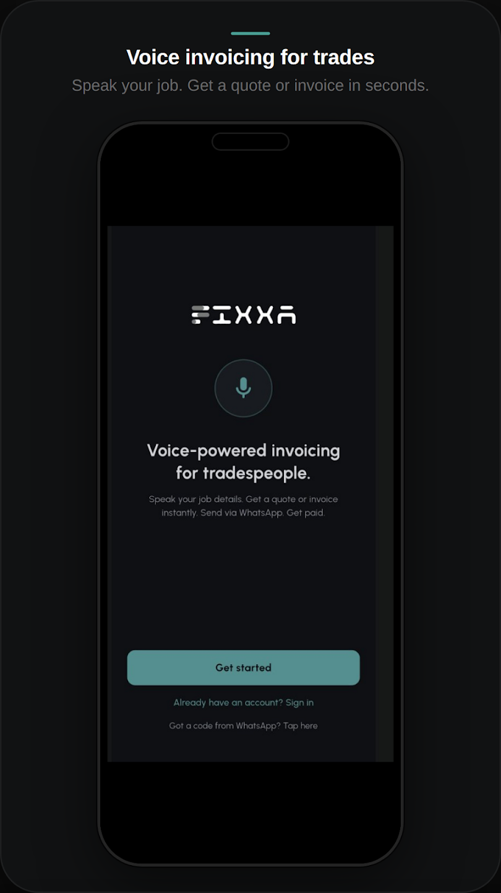
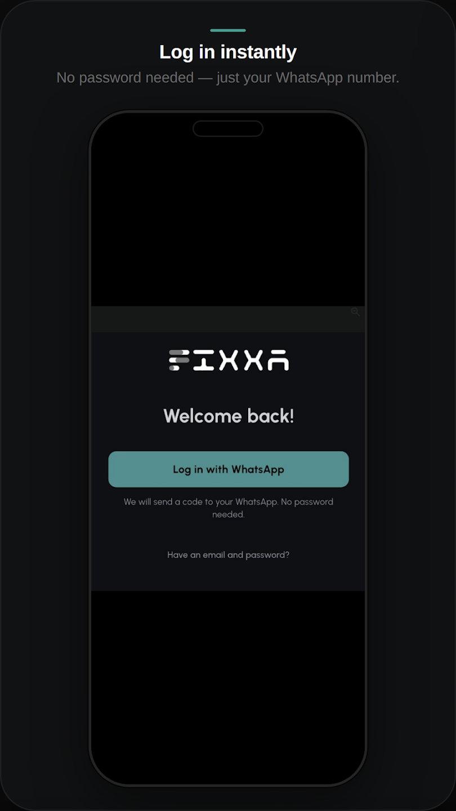
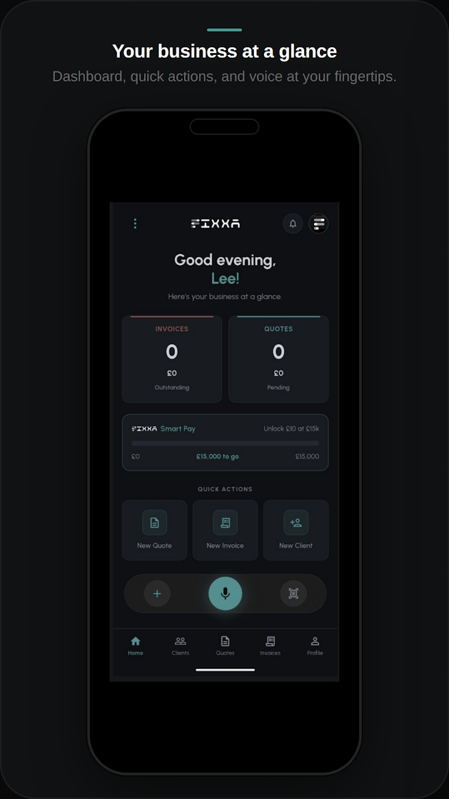
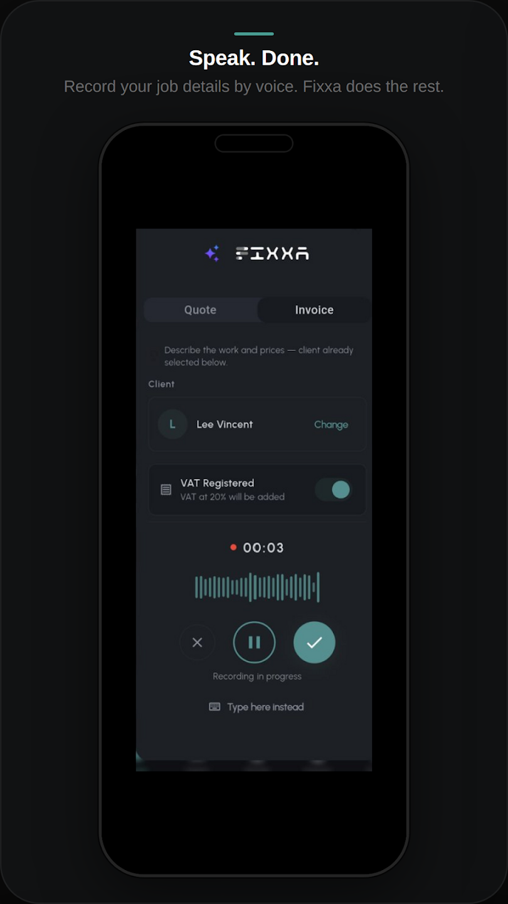
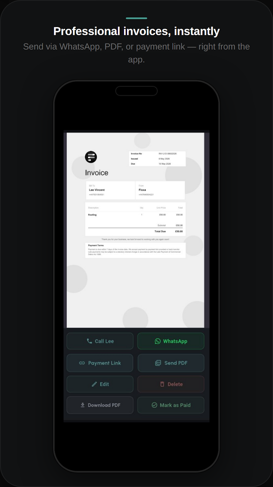
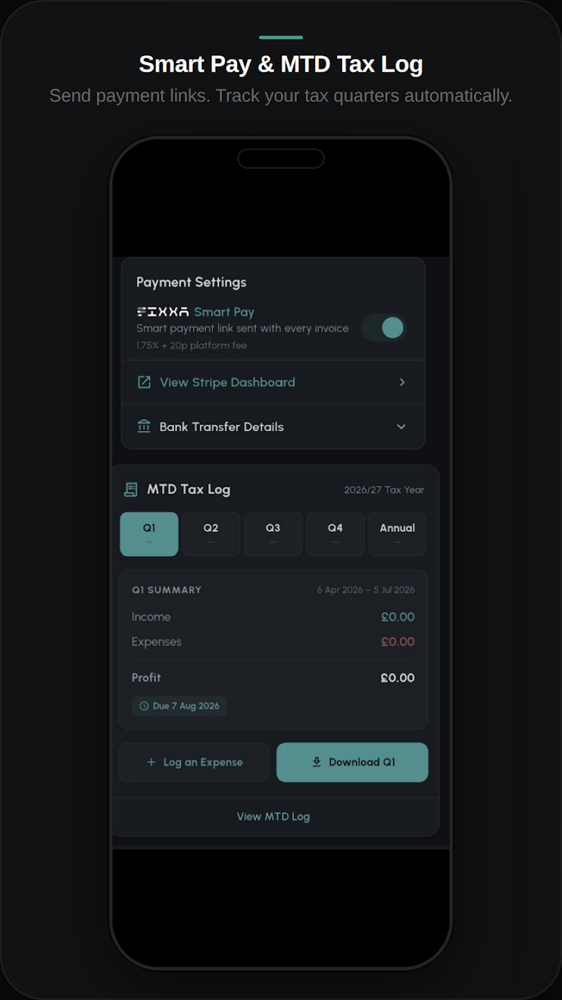

# Fixxa App SaaS Backend

[](https://play.google.com/store/apps/details?id=com.leevincent.fixxa)

A production-oriented Django REST backend for service businesses to manage clients, create quotes/invoices, accept payments, and automate workflows with AI, notifications, and integrations.

## App Screenshots

<p align="center">
  
  
  
  
  
  
</p>

## Overview

Fixxa is a multi-app SaaS backend built with Django + DRF. It provides:
- OTP-based onboarding and JWT auth
- Referral and trial logic
- Business profile and Stripe Connect onboarding
- Client management with organized media folders
- Quote and invoice lifecycle management
- Stripe payment links and webhook handling
- AI-assisted quote/invoice creation from voice and documents
- Push notifications via OneSignal/Firebase
- Dockerized deployment with Nginx, Redis, Celery worker, and Celery beat

## Tech Stack

- Python 3.11
- Django 5.2
- Django REST Framework
- SimpleJWT (token + refresh + blacklist)
- PostgreSQL/SQLite (configurable)
- Redis
- Celery + Celery Beat
- Stripe + Stripe Connect
- OneSignal + Firebase Admin
- OpenAI + LangChain components
- ReportLab / OpenPyXL / Pandas / PyPDF2
- Docker + Docker Compose + Nginx + Gunicorn

## Project Structure

- authapp: auth, OTP, referrals
- businessapp: business profile + Stripe Connect onboarding
- clientapp: client records, summary endpoints, folder structure hooks, CRM webhooks
- quoteapp: folders, quotes, invoices, PDF/payment flows, AI endpoints
- notificationapp: device token registration and in-app/push notifications
- myproject: global settings, urls, celery bootstrap
- utils: payment helpers, HubSpot/n8n integration clients
- fixxa_AI: AI module utilities, docs, testing helpers

## Core Features

### 1. Authentication and User Onboarding
- Email/password signup with OTP verification
- OTP resend and password reset flow
- JWT access/refresh token flow
- Logout with refresh token blacklisting
- Referral code generation and referral statistics

### 2. Business Setup
- Create/update business profile per user
- Stripe Connect onboarding flow
- Stripe account status endpoint

### 3. Client Management
- CRUD endpoints for clients
- Client summary endpoint
- Additional client service ViewSet routes
- Auto-organized media folder scaffolding
- Outbound webhook hooks for external sync workflows

### 4. Quote and Invoice Management
- Folder-based organization
- Quote CRUD with quote-to-invoice conversion
- Invoice CRUD and status/payment metadata
- Counter-based quote/invoice numbering
- Line-item level totals, discounts, and VAT calculations
- Scan upload endpoint

### 5. Payments
- Stripe Checkout session helper logic
- Stripe webhook endpoint for payment events
- Payment success/redirect endpoints

### 6. AI Workflows
- Voice to quote creation
- Voice to invoice creation
- Document to quote extraction
- Document to invoice extraction
- AI chat query endpoint for business data interactions
- Upload-PDF endpoints for voice-created records

### 7. Notifications
- Register/delete device tokens
- List and mark notifications as read
- Test push endpoint

## API Routing Summary

Base routes registered in the main URL config:
- /admin/
- /api/token/
- /api/token/refresh/
- /auth/
- /businessapp/
- /clientapp/
- /quoteapp/
- /notificationapp/
- /payment-success/
- /payment/<invoice_id>/

Examples:
- POST /auth/signup/
- POST /auth/verify-otp/
- POST /businessapp/stripe/connect/
- GET/POST /clientapp/clients/
- GET/POST /quoteapp/quotes/
- POST /quoteapp/quotes/<id>/create-invoice/
- POST /quoteapp/ai/voice/quote/
- POST /quoteapp/ai/document/invoice/
- POST /notificationapp/device-token/register/

## Data Model Highlights

- Custom User model (UUID PK)
- OTP model with expiry + one-time use
- ReferralCode and ReferralUse tracking
- BusinessProfile linked to each user
- Client entity with metadata + soft-delete style fields
- Folder entity for quote/invoice grouping
- Quote + QuoteItem models for proposal workflows
- Invoice + InvoiceItem models for billing workflows
- QuoteToken for external approval/rejection flows
- Notification + DeviceToken for messaging/push

## Environment Variables

This project relies on a .env file. Key variables include:

- Core:
  - SECRET_KEY
  - DEBUG
  - ALLOWED_HOSTS
  - BASE_URL

- Database:
  - DB_ENGINE
  - DB_NAME
  - DB_HOST
  - DB_PORT
  - DB_USER
  - DB_PASSWORD
  - SQLITE_PATH

- Auth/JWT:
  - ACCESS_TOKEN_LIFETIME
  - REFRESH_TOKEN_LIFETIME

- Email/OTP:
  - EMAIL_BACKEND
  - EMAIL_HOST
  - EMAIL_PORT
  - EMAIL_USE_TLS
  - EMAIL_HOST_USER
  - EMAIL_HOST_PASSWORD
  - DEFAULT_FROM_EMAIL

- Stripe:
  - STRIPE_SECRET_KEY
  - STRIPE_PUBLIC_KEY
  - STRIPE_WEBHOOK_SECRET

- AI:
  - OPENAI_API_KEY

- Notifications:
  - ONESIGNAL_APP_ID
  - ONESIGNAL_REST_API_KEY

- Optional infra:
  - REDIS_URL
  - CELERY_BROKER_URL
  - CELERY_RESULT_BACKEND
  - CORS_ALLOWED_ORIGINS
  - CSRF_TRUSTED_ORIGINS

## Local Development Setup

### Option A: Run with Docker (recommended)

1. Create a .env file at project root and fill required variables.
2. Build images:

```bash
docker-compose build
```

3. Start services:

```bash
docker-compose up -d
```

4. Check logs:

```bash
docker-compose logs -f web
```

The entrypoint runs migrations and collectstatic automatically before launching Gunicorn.

### Option B: Run directly with Python

1. Create and activate virtual environment.
2. Install dependencies:

```bash
pip install -r requirements.txt
```

3. Add .env with required values.
4. Run migrations:

```bash
python manage.py migrate
```

5. Start server:

```bash
python manage.py runserver
```

6. Optional Celery processes:

```bash
celery -A myproject worker -l info
celery -A myproject beat -l info
```

## Docker Services

- redis: cache/broker
- web: Django + Gunicorn
- celery_worker: async tasks
- celery_beat: periodic scheduler
- nginx: reverse proxy + static/media serving

## Security Notes

- Production-focused security flags are enabled when DEBUG=False
- JWT auth configured with access/refresh tokens
- CSRF trusted origins and CORS allowed origins are environment-driven
- Sensitive secrets are loaded from environment variables

## Testing

Run all tests:

```bash
python manage.py test
```

Run app-specific tests:

```bash
python manage.py test authapp
python manage.py test quoteapp
python manage.py test clientapp
python manage.py test businessapp
python manage.py test notificationapp
```

## Useful Interview Talking Points

- Custom multi-tenant style data ownership by authenticated user across apps
- End-to-end quote-to-invoice-to-payment workflow with Stripe Connect
- AI-enhanced productivity pipeline (voice/document to structured billing data)
- Event-driven integration readiness (signals, webhooks, async workers)
- Production deployment path via Docker + Nginx + Gunicorn + Redis + Celery
- Modular app design for clear domain boundaries

## Known Implementation Notes

- Celery app exists and Docker includes worker/beat services; confirm uncommented CELERY_* settings strategy for your environment.
- Email variables are required for OTP and password flows.
- Ensure webhook secrets and public base URL are correct before production.

## Additional Docs

- fixxa_AI/BACKEND_INTEGRATION_GUIDE.md
- fixxa_AI/FINAL_POSTMAN_TESTING.md
- fixxa_AI/backend_demo.md

## License

Proprietary/Internal (update this section if you want MIT/Apache-2.0 or another license).
